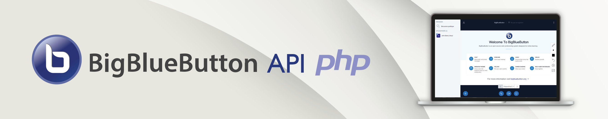

  [Home](../Home.md)
| [Getting Started](../general/getting_started.md)
| [Meetings](../api_calls/meetings.md)
| [Recordings](../api_calls/recordings.md)
| [Hooks](../api_calls/hooks.md)
| [Configuration of the BBB-Server](../api_calls/bbb_config.md)
---
> [!WARNING]
> Documentation is a bit outdated and currently under review!
---

# Meetings
In the BigBlueButton-world a video-conference is called a meeting. Once the meeting a meeting is created, it is already a "ready-to-use" video-conference which is waiting for people to join. A BBB-meeting is not something that would be created in advance (e.g. one week prior) in order to distribute a meeting-link to the participants.

## Administration
### Creating
<sup>[API Reference](https://docs.bigbluebutton.org/development/api/#create)</sup>

One of the first steps is the creation of a meeting. A successfully created meeting is the prerequisite to enable participants (moderators and viewers) to join that meeting.

#### Default meeting
```php
use BigBlueButton\BigBlueButton;
use BigBlueButton\Parameters\CreateMeetingParameters;

// you can choose your own meeting number and title
$meetingId   = 123456;
$meetingName = "My first BBB-meeting";

// define the required parameters for the meeting
$createMeetingParameters = new CreateMeetingParameters($meetingId, $meetingName);

// create an instance of the BBB-Client (see details in the setup description)
$bbb = new BigBlueButton();

// send the request to the BBB-Server to create a meeting and receive its response
$createMeetingResponse = $bbb->createMeeting($createMeetingParameters);

if ($createMeetingResponse->failed()) {
    throw new \Exception('The meeting was not created!');
} else {
    // steps once meeting has been created
}
```

#### Customized meeting
To adapt the predefined parameters for the meeting, the parameters for the meeting creation must be adapted before launching the creation-request to the BBB-Server. Please check the official API-Reference for all the possible settings.
```php
// ...

$createMeetingParameters
    ->setWelcomeMessage('Dear Student, welcome to our lesson today!')
    ->setWebcamsOnlyForModerator('Dear lecture, do not forget to be kind!')
    ;

// ...
```

### Insert Document
<sup>[API Reference](https://docs.bigbluebutton.org/development/api/#insertdocument)</sup>

(tbd)

### Joining
<sup>[API Reference](https://docs.bigbluebutton.org/development/api/#join)</sup>

```php

use BigBlueButton\BigBlueButton;
use BigBlueButton\Parameters\JoinMeetingParameters;

$bbb = new BigBlueButton();

// $moderator_password for moderator
$joinMeetingParams = new JoinMeetingParameters($meetingID, $name, $password);
$joinMeetingParams->setRedirect(true);
$url = $bbb->getJoinMeetingURL($joinMeetingParams);

// header('Location:' . $url);
```

### Ending
<sup>[API Reference](https://docs.bigbluebutton.org/development/api/#end)</sup>

```php

use BigBlueButton\BigBlueButton;
use BigBlueButton\Parameters\EndMeetingParameters;

$bbb = new BigBlueButton();

$endMeetingParams = new EndMeetingParameters($meetingID, $moderator_password);
$response = $bbb->endMeeting($endMeetingParams);
```

## Monitoring
### Is Meeting Running
(tbd)

### Get Meeting Info
```php

use BigBlueButton\BigBlueButton;
use BigBlueButton\Parameters\GetMeetingInfoParameters;

$bbb = new BigBlueButton();

$getMeetingInfoParams = new GetMeetingInfoParameters($meetingID, $moderator_password);
$response = $bbb->getMeetingInfo($getMeetingInfoParams);
if ($response->getReturnCode() == 'FAILED') {
	// meeting not found or already closed
} else {
	// process $response->getRawXml();
}
```

### Get Meetings
```php

use BigBlueButton\BigBlueButton;

$bbb = new BigBlueButton();
$response = $bbb->getMeetings();

if ($response->getReturnCode() == 'SUCCESS') {
	foreach ($response->getRawXml()->meetings->meeting as $meeting) {
		// process all meeting
	}
}
```